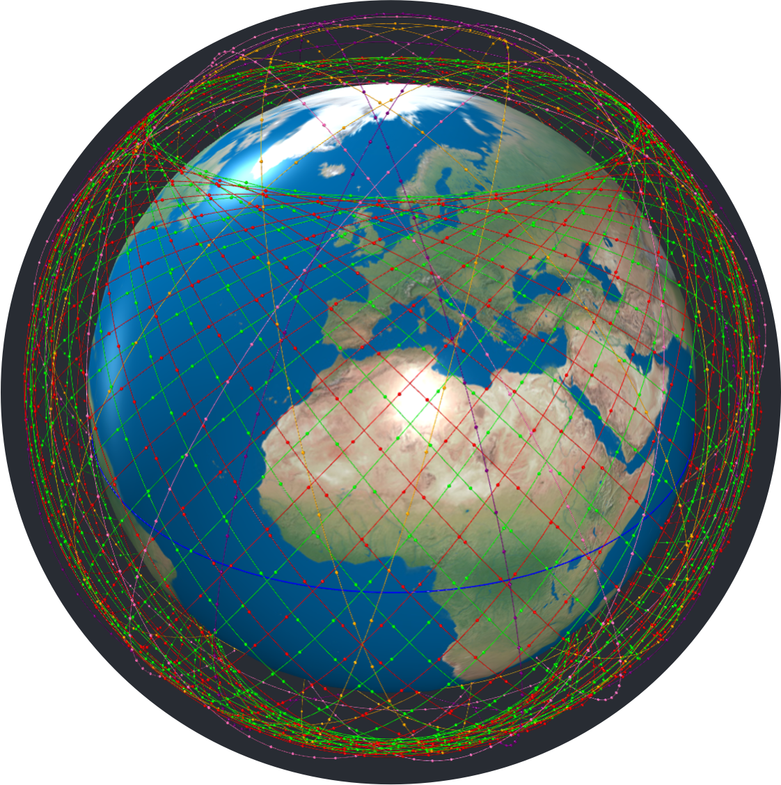
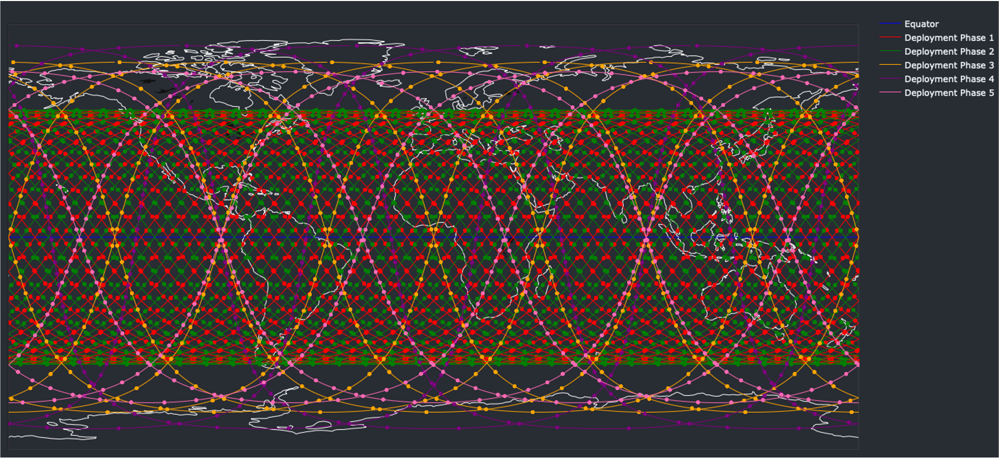

# STARLINK
Repository for 20/21 Masters Project


 ### Setup

 These intstructions are for Ubuntu/Debian Linux to install requirements, :

```bash
 sudo apt-get install python3-pip
 pip install virtualenv
 python3 -m venv venv
 source venv/bin/activate
 pip install -r requirements.txt
```

Then run the simulation with synchronised 3d space and ground track plotting execute as following

```bash
python main.py
```

The command line interface will display the features of the simulation and these can be edited as you wish. Currently, only one phase of deployment is supported. When getting through the CLI, the 3d simulation will pop up in your default browser with the specified characteristics.

If you are running for the first time, the 2d simulation displaying the shortest paths will need to compute the network graphs at each moment in time for a specified interval. To do this you will have to execute graphcomp.py.

You can click the IP in the terminal to view the live geographical representation of the simulation.

To kill the execution:

```bash
killall python
```



