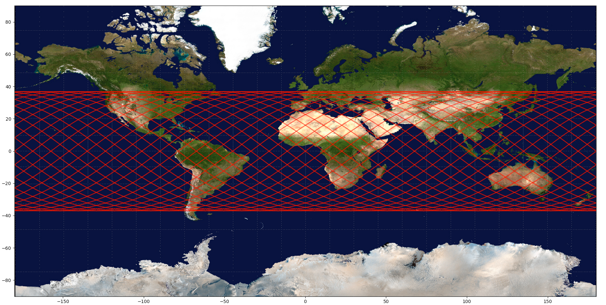

# STARLINK
Repository for 20/21 Masters Project


 ### Setup

 These intstructions are for Ubuntu/Debian Linux to install requirements, :

```bash
 sudo apt-get install python3-pip
 pip install -r requirements.txt
```

Then run sim.py with python3:

        python3 sim.py


