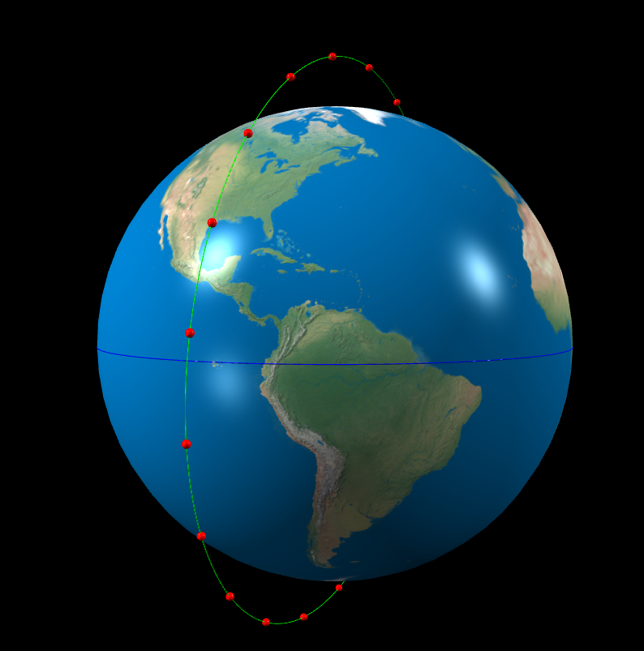
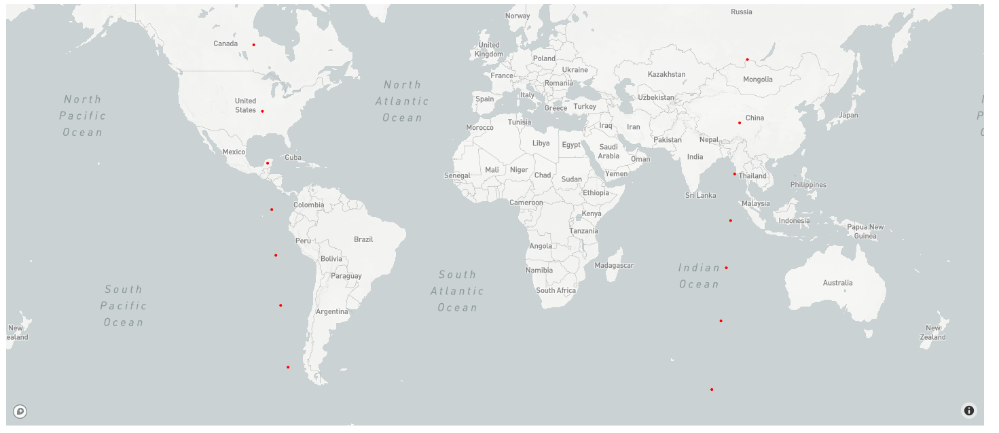

# Intersatellite network constellation simulation

## First Setup and Run

First setup your python3 environment. Then install all the required packages:

`$ cat requirements.txt | xargs -n 1 pip3 install
`

Then you can run the simulation by executing `main.py`

`$ python3 main.py`

The following will show in the terminal

The table shown contains the characteristics of the constellation for a single orbital shell with all satellites at the same altitude.
The altitude is in metres and the inclination is in degrees. 1) allows you to change the features of the constellation. If you are unsure about phase offset, leave it unchanged for now. 2) allows you to change the speed at which the simulation is ran. If you do not wish to change any of the characteristics and will just run the simulation, select 3).

You will then be asked how long you would like the simulation to run for. Satellites in the simulation will stop moving after this timestamp. If you would like to view the constellation at a specific time point, you can run the simulation until then.

You will most likely get the following warning at first, it is just a warning so you can ignore it.

`GRAPH ERROR: The graphs for this configuration have not been computed therefore the network paths will not work.`

The simulation should launch in a browser window with the satellites orbiting the earth for the time specified.

In the terminal also there will be a link for an IP address. clicking this will show the geographical representation of the simuilation at the same time.

## Inner Workings

The library which the simulation is built upon, VPython, uses a 3D cartesian coordinate system. Each second, a file `XXX/plane_positions.pck` is updated to contain the exact cartesian positions of all the satellites in the simulation at that time point. XXX is the altitude you selected for the satellites when setting up.

The file `plane_positions.pck` contains a timestamp and all positions of the satellites. An example of this data structure for a constellation with 20 satellites looks like this:

`[100, [[803073.6794207114, 7548724.6873791665, 660427.8342239518], [3102816.4226500397, 6945138.2395933755, 607620.8625848129], [5101173.454733103, 5666541.535863518, 495758.14578683604], [6605711.937170634, 3839193.2509312397, 335885.88654172124], [7472475.19028996, 1641067.8929180996, 143574.83670670877], [7618894.142850278, -715297.4657995077, -62580.41930627938], [7031058.340849684, -3002712.9761407543, -262703.34523450455], [5764926.906439556, -5000378.402080697, -437476.42352193606], [3941414.880131794, -6514429.573112592, -569938.7369853774], [1735633.4849236782, -7396363.389286897, -647097.9478807851], ....]]`

This is used to update the geographical representation repetitively using the 3d simulation at regular intervals

Another file `XXX/positions.pck` is a dictionary which contains positions of all satellites at every passed time point. Essentially, every list which is produced for `plane_positions.pck`, is entered into the full dictionary of positions which stored by `positions.pck`. An example disctionary is shown below

`{'0': [[79734.71708995514, 7590928.048427887, 664120.1498784063], [2428799.7618377768, 7207182.836463144, 630546.7941491386], [4541689.949322712, 6122105.42612923, 535614.8216968541], ..., [-4442242.554472597, 6141709.1024248665, 537329.9211361563], [-2314776.818673707, 7220739.513306405, 631732.8496880113]],`

`'1': [[86982.59973703715, 7590845.629180153, 664112.9391285733], [2435658.4502670127, 7204880.091744172, 630345.3300912344], ... [-2307859.0499059907, 7222931.2239832, 631924.5995259596]], `

`'2': [[94230.40368278846, 7590756.341781156, 664105.1274933653], [2442514.944598396, 7202570.85670143, 630143.2982035776], [4553296.0863681445, 6113519.324658917, 534863.6351543184], ...  [-2300939.1836202866, 7225116.370035449, 632115.7750336798]], `

`'3': [[101478.1223693242, 7590660.186302369, 664096.7149790355] .....`

These are used later to compute network graphs at each timepoint.

## Network Graph Computation

